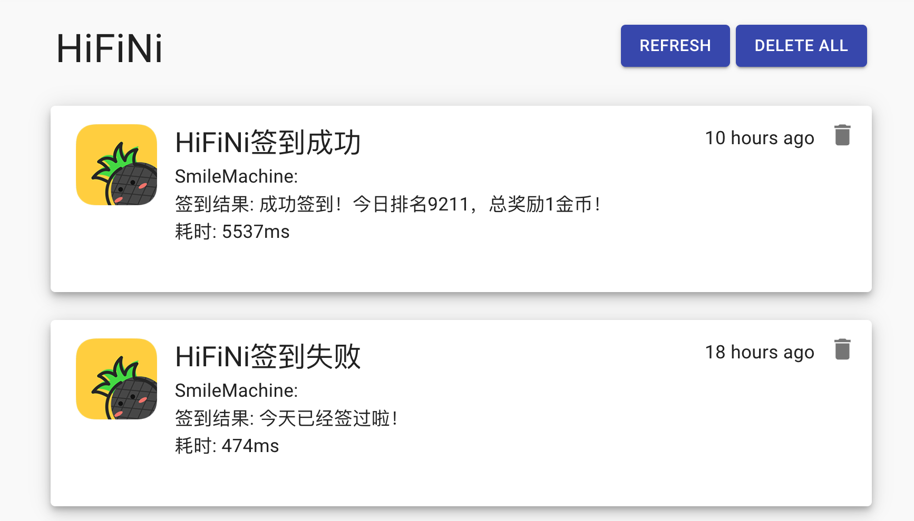

# 配置 Gotify 推送

## 简介

[Gotify](https://gotify.net/) 是一个自托管的通知服务器，所有的数据都在自己的服务器上，不依赖第三方服务，适合自己的私人服务器。

这种推送方式比较折腾，如果已经部署了可以直接使用这种渠道，没有特殊需求可以使用其他方式。

## 设置指南

1. 部署 Gotify：https://gotify.net/docs/install，假设地址为 `https://gotify.example.com`
2. 部署成功后，访问 `https://gotify.example.com` 的 Web 界面。
3. 创建一个应用
   
4. 复制 Gotify App Token
   
5. 设置 GitHub Secrets
   - `GOTIFY_URL`: Gotify URL，如 `https://gotify.example.com`
   - `GOTIFY_APP_TOKEN`: Gotify App Token
6. 测试推送，填写后可以手动运行 workflow
7. 成功推送案例
   
8. [可选], 可以下载 Gotify Android 客户端，用于手机端接收消息。

## 注意事项

1. 如果想要浏览器端接收消息，可以保持网页打开，并且开启该域名的通知权限。
2. 如果想要手机端接收消息，需要设置 app 不被系统杀后台，并且设置电池管理为无限制等等。
